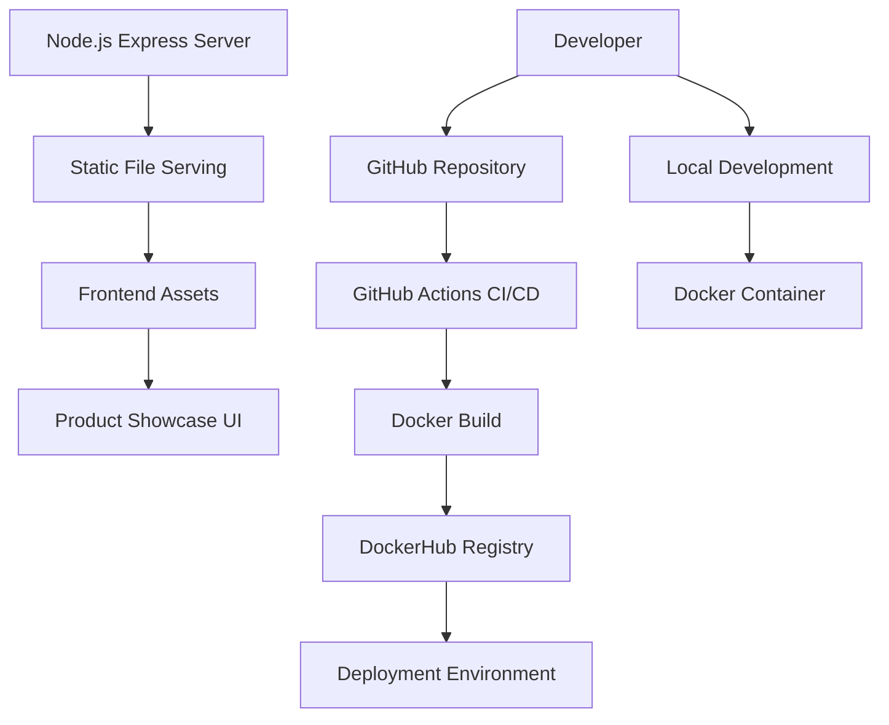

# Design Document

## Overview

This design transforms the existing React/Vite application into a Node.js Express-based e-commerce application with complete CI/CD pipeline integration. The solution involves creating a new Node.js backend structure while preserving the existing UI components and converting them to static HTML/CSS/JavaScript. The application will be containerized with Docker and deployed through GitHub Actions to DockerHub.

## Architecture

### High-Level Architecture



### Technology Stack

- **Backend**: Node.js with Express.js framework
- **Frontend**: Static HTML, CSS, JavaScript (converted from React components)
- **Containerization**: Docker with Node.js 18 base image
- **CI/CD**: GitHub Actions workflow
- **Registry**: DockerHub for image storage
- **Styling**: CSS Grid/Flexbox for responsive design

## Components and Interfaces

### 1. Express Server Component (`app.js`)

**Purpose**: Main server application handling HTTP requests and static file serving

**Key Features**:
- Express.js framework setup
- Static file middleware for public directory
- Environment-based port configuration
- Root route handler for index.html
- Error handling and logging

**Interface**:
```javascript
// Server Configuration
const express = require('express');
const app = express();
const PORT = process.env.PORT || 3000;

// Middleware
app.use(express.static('public'));

// Routes
app.get('/', (req, res) => res.sendFile(__dirname + '/public/index.html'));

// Server Start
app.listen(PORT, callback);
```

### 2. Frontend Static Assets

**Structure**:
```
public/
├── index.html          # Main HTML page
├── style.css          # Responsive CSS styles
├── script.js          # Interactive JavaScript
└── images/            # Product images
    ├── laptop.jpg
    ├── smartphone.jpg
    └── headphones.jpg
```

**Key Features**:
- Responsive product card layout using CSS Grid
- Kiro branding integration
- Interactive cart functionality
- Mobile-first responsive design

### 3. Product Showcase Interface

**HTML Structure**:
```html
<div class="product-showcase">
  <div class="product-card">
    
    <h3>HP Laptop</h3>
    <p class="price">₹49,999</p>
    <button class="add-to-cart-btn">Add to Cart</button>
  </div>
</div>
```

**CSS Grid Layout**:
```css
.product-showcase {
  display: grid;
  grid-template-columns: repeat(auto-fit, minmax(300px, 1fr));
  gap: 2rem;
  padding: 2rem;
}
```

### 4. Docker Configuration

**Dockerfile Strategy**:
- Multi-stage build optimization
- Node.js 18 Alpine base for smaller image size
- Proper layer caching with package.json copy first
- Security best practices with non-root user
- Health check implementation

**Container Interface**:
```dockerfile
FROM node:18-alpine
WORKDIR /app
COPY package*.json ./
RUN npm ci --only=production
COPY . .
EXPOSE 3000
USER node
HEALTHCHECK --interval=30s --timeout=3s --start-period=5s --retries=3 \
  CMD curl -f http://localhost:3000/ || exit 1
CMD ["node", "app.js"]
```

### 5. CI/CD Pipeline Interface

**GitHub Actions Workflow**:
- Trigger: Push to main branch
- Jobs: Test → Build → Deploy
- Secrets management for DockerHub credentials
- Artifact caching for faster builds
- Multi-environment support

**Pipeline Stages**:
1. **Setup**: Checkout code, setup Node.js 18
2. **Test**: Install dependencies, run test suite
3. **Build**: Create Docker image with semantic versioning
4. **Deploy**: Push to DockerHub with latest and version tags

## Data Models

### Product Model
```javascript
const Product = {
  id: String,           // Unique identifier
  name: String,         // Product name
  price: Number,        // Price in rupees
  image: String,        // Image file path
  description: String,  // Product description
  category: String,     // Product category
  inStock: Boolean      // Availability status
};
```

### Cart Model
```javascript
const CartItem = {
  productId: String,    // Reference to product
  quantity: Number,     // Item quantity
  addedAt: Date        // Timestamp
};

const Cart = {
  items: [CartItem],    // Array of cart items
  total: Number,        // Calculated total
  itemCount: Number     // Total item count
};
```

## Error Handling

### Server Error Handling
- **404 Errors**: Serve custom 404 page for unknown routes
- **500 Errors**: Log server errors and serve generic error page
- **Static File Errors**: Graceful fallback for missing assets
- **Port Binding Errors**: Clear error messages for port conflicts

### Frontend Error Handling
- **Image Loading**: Fallback placeholder images
- **Cart Operations**: User feedback for add/remove actions
- **Network Errors**: Retry mechanisms and user notifications
- **Validation**: Client-side form validation with clear messages

### Docker Error Handling
- **Build Failures**: Clear error messages in CI/CD logs
- **Runtime Errors**: Health checks and restart policies
- **Resource Limits**: Memory and CPU constraints
- **Network Issues**: Proper port mapping and connectivity checks

## Testing Strategy

### Unit Testing
- **Server Tests**: Express route testing with supertest
- **Frontend Tests**: JavaScript function testing with Jest
- **Component Tests**: Individual UI component testing
- **Utility Tests**: Helper function validation

### Integration Testing
- **API Integration**: End-to-end request/response testing
- **Database Integration**: Mock data persistence testing
- **Docker Integration**: Container functionality testing
- **CI/CD Integration**: Pipeline validation testing

### Test Structure
```
test/
├── unit/
│   ├── server.test.js      # Express server tests
│   ├── cart.test.js        # Cart functionality tests
│   └── utils.test.js       # Utility function tests
├── integration/
│   ├── api.test.js         # API endpoint tests
│   └── docker.test.js      # Container tests
└── fixtures/
    ├── products.json       # Test data
    └── responses.json      # Mock responses
```

### Testing Commands
```json
{
  "scripts": {
    "test": "jest",
    "test:watch": "jest --watch",
    "test:coverage": "jest --coverage",
    "test:docker": "docker run --rm nodejs-demo-app npm test"
  }
}
```

## Security Considerations

### Application Security
- **Input Validation**: Sanitize all user inputs
- **CORS Configuration**: Proper cross-origin resource sharing
- **Rate Limiting**: Prevent abuse with request throttling
- **Security Headers**: Implement security-focused HTTP headers

### Container Security
- **Non-root User**: Run container processes as non-root
- **Minimal Base Image**: Use Alpine Linux for smaller attack surface
- **Dependency Scanning**: Regular vulnerability scanning
- **Secret Management**: Secure handling of sensitive data

### CI/CD Security
- **Secret Storage**: GitHub Secrets for sensitive credentials
- **Access Control**: Limited permissions for workflow actions
- **Image Scanning**: Vulnerability scanning of Docker images
- **Audit Logging**: Comprehensive logging of pipeline activities

## Performance Optimization

### Frontend Performance
- **Asset Optimization**: Minified CSS and JavaScript
- **Image Optimization**: Compressed product images
- **Caching Strategy**: Browser caching for static assets
- **Lazy Loading**: Progressive image loading

### Server Performance
- **Static File Caching**: Express static middleware optimization
- **Compression**: Gzip compression for responses
- **Connection Pooling**: Efficient request handling
- **Memory Management**: Proper resource cleanup

### Docker Performance
- **Layer Optimization**: Efficient Dockerfile layer structure
- **Multi-stage Builds**: Smaller production images
- **Build Caching**: Optimized build context
- **Resource Limits**: Appropriate memory and CPU allocation

## Deployment Strategy

### Local Development
```bash
# Development setup
npm install
npm run dev

# Docker development
docker build -t nodejs-demo-app .
docker run -p 3000:3000 nodejs-demo-app
```

### Production Deployment
```bash
# Automated via GitHub Actions
git push origin main

# Manual deployment
docker pull venkateshkallu/nodejs-demo-app:latest
docker run -d -p 3000:3000 venkateshkallu/nodejs-demo-app:latest
```

### Environment Configuration
- **Development**: Local Node.js with hot reload
- **Testing**: Docker container with test database
- **Production**: DockerHub image with production optimizations
- **Staging**: Branch-based deployments for testing